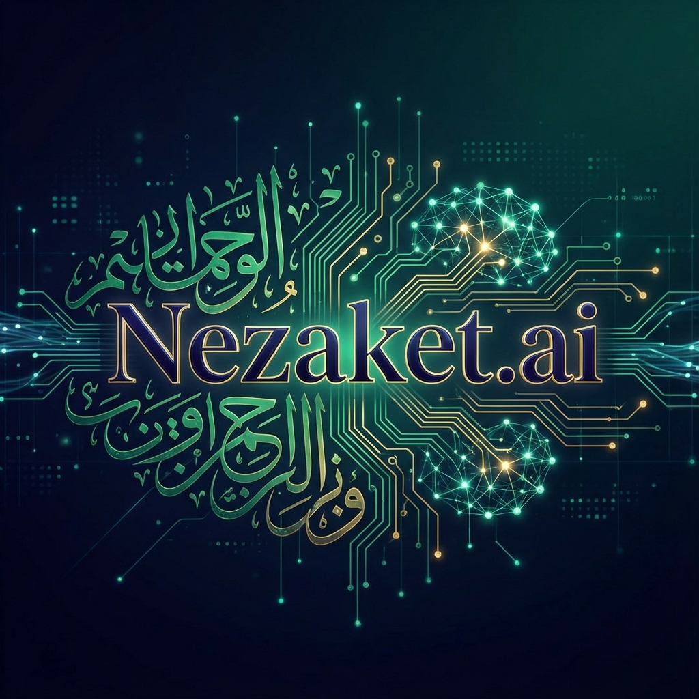

<div align="center">



# 🎩 **Nezaket.ai**

### *“Dijital Çağda Zarafetin Yapay Zekası”*

[](https://nextjs.org/)
[](https://www.typescriptlang.org/)
[](https://tailwindcss.com/)
[](https://react.dev/)
[](https://sdk.vercel.ai/docs)
[](https://tr.wikipedia.org/wiki/Adab-%C4%B1_mua%C5%9Feret)

<br/>

**Nezaket.ai**, köklerini kadim medeniyetimizin inceliklerinden alan, yüzünü ise geleceğin teknolojisine dönmüş bir **Dijital Nezaket Koçu**dur. 
Google Gemini motoruyla güçlendirilmiş, kültürel kodlara hakim ve her zaman kibar.

[Canlı Demo (Yakında)]() · [Hata Bildir](https://github.com/bahattinyunus/Adab_i_muaseret/issues) · [Özellik İste](https://github.com/bahattinyunus/Adab_i_muaseret/issues)

</div>

---

## 🏗️ **Proje Yapısı**

Modern, temiz ve sürdürülebilir bir mimari.

```bash
Nezaket.ai/
├── 📂 web/                # Next.js Uygulaması
│   ├── 📂 app/            # App Router (Sayfalar & API)
│   │   ├── 📂 api/chat/   # AI Endpoint (Beyin Takımı)
│   │   ├── 📄 page.tsx    # Ana Sohbet Arayüzü
│   │   └── 📄 global.css  # Premium Tasarım Kodları
│   ├── 📂 lib/            # Yardımcı Kütüphaneler
│   └── 📄 tailwind.config # Stil Konfigürasyonu
└── 📄 README.md           # Şu an okuduğunuz kılavuz
```

---

## 🌟 **Öne Çıkan Özellikler**

| Özellik | Açıklama |
| :--- | :--- |
| **🧠 Empatik AI** | Sadece cevap vermez; halden anlar, kültürümüze uygun konuşur. |
| **✨ Premium UI** | Apple/Tesla estetiğinde, yormayan minimalist arayüz. |
| **⚡ Anlık Çözüm** | "Düğüne eli boş gidilir mi?" sorusuna 2 saniyede yanıt. |
| **🛡️ Gizlilik** | Konuşmalarınız tamamen anonim. Sadece siz ve asistanınız arasında. |

---

## 🚀 **Nasıl Çalıştırılır?**

Terminali aç ve sihire başla:

```bash
# 1. Projeyi İndir
git clone https://github.com/bahattinyunus/Adab_i_muaseret.git

# 2. Klasöre Gir
cd Adab_i_muaseret/web

# 3. Bağımlılıkları Yükle
npm install

# 4. API Anahtarını Ayarla
# (.env.example dosyasının ismini .env.local yap ve anahtarını yapıştır)

# 5. Başlat!
npm run dev
```

---

## 📸 **Ekran Görüntüleri**

> *Tasarım görselleri v1.0 sürümüyle eklenecektir.*

---

<div align="center">

*"Zarafet, gözetlenmediğinde bile doğru olanı yapmaktır."*

---
© 2025 Nezaket.ai Ekibi. MIT Lisansı ile sevgiyle kodlandı.

</div>
